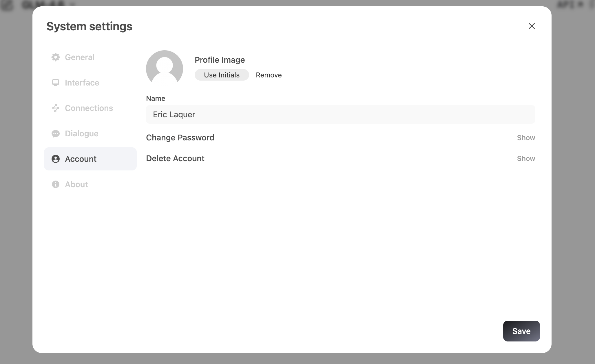
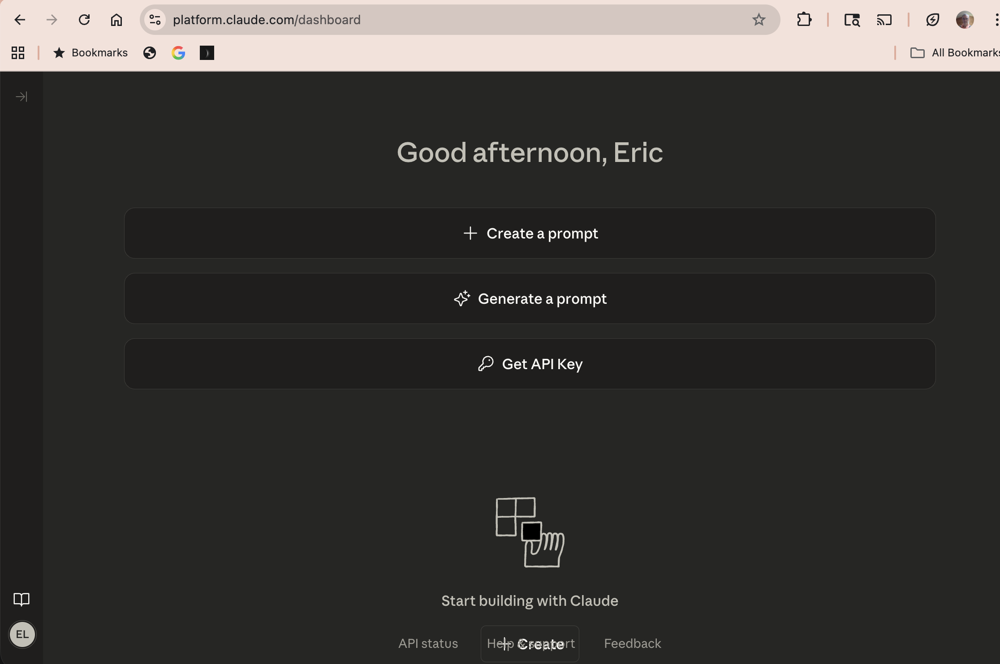
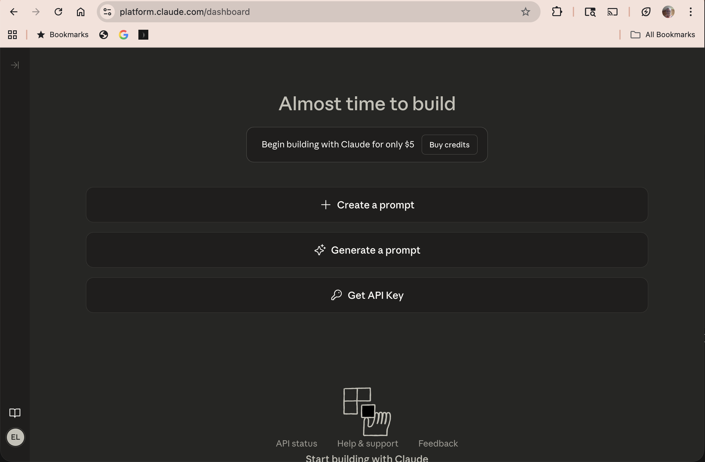
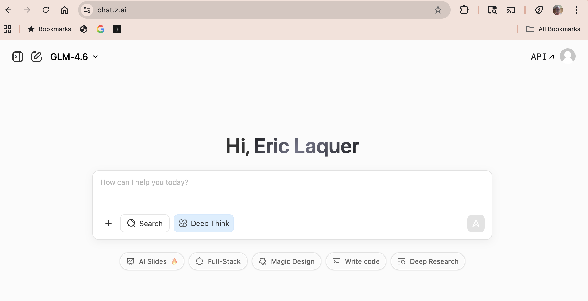

# SwarmPod Onboarding Checklist

Step-by-step guide to setting up all services for swarmpod-gem development.

---

## 1. Anthropic API Account

You need an Anthropic API key with credits to use Claude programmatically.

- [ ] Create an account at [console.anthropic.com](https://console.anthropic.com)
- [ ] Navigate to **Settings > API Keys** and generate a new key
- [ ] Add billing credits under **Settings > Billing**

  
  

- [ ] Save your key:

  ```bash
  cp secrets_example/anthropic/ANTHROPIC_API_KEY.sh secrets/anthropic/ANTHROPIC_API_KEY.sh
  # Edit the file and paste your real key (starts with sk-ant-)
  ```

- [ ] Verify: `bin/verify_anthropic_connection`

---

## 2. Install Claude CLI

The Claude CLI (Claude Code) is used for interactive onboarding and development.

- [ ] Install: `npm install -g @anthropic-ai/claude-code`
- [ ] Verify: `claude --version`
- [ ] Verify: `bin/verify_claude_connection`

  
  

---

## 3. GitHub Access

You need a GitHub account and personal access token for repo access and the `gh` CLI.

- [ ] Create a personal access token at [github.com/settings/tokens](https://github.com/settings/tokens)
  - Required scopes: `repo`, `read:org`
- [ ] Save your credentials:

  ```bash
  cp secrets_example/github/GITHUB_ACCOUNT.sh secrets/github/GITHUB_ACCOUNT.sh
  cp secrets_example/github/GITHUB_ACCESS_TOKEN.sh secrets/github/GITHUB_ACCESS_TOKEN.sh
  # Edit both files with your username and token
  ```

- [ ] Install the GitHub CLI: `brew install gh` (macOS) or see [cli.github.com](https://cli.github.com)
- [ ] Authenticate: `gh auth login`
- [ ] Verify: `bin/verify_github_connection`

---

## 4. SwarmPod Gem Repo Access

Confirm you can access the swarmpod-gem repository.

- [ ] Save the repo URL:

  ```bash
  cp secrets_example/ip/swarmpod-gem/SWARMPOD_GEM_GITHUB_REPO.sh secrets/ip/swarmpod-gem/SWARMPOD_GEM_GITHUB_REPO.sh
  # Edit with the actual repo URL
  ```

- [ ] Verify: `bin/verify_swarmpod_connection`

  

---

## 5. Hostinger VPS (Optional)

If you're deploying to a Hostinger VPS:

- [ ] Save your Hostinger credentials:

  ```bash
  cp secrets_example/deployment/Hostinger/HOSTINGER_ACCOUNT.sh secrets/deployment/Hostinger/HOSTINGER_ACCOUNT.sh
  cp secrets_example/deployment/Hostinger/HOSTINGER_PASSWORD.sh secrets/deployment/Hostinger/HOSTINGER_PASSWORD.sh
  cp secrets_example/deployment/Hostinger/HOSTINGER_SERVER.sh secrets/deployment/Hostinger/HOSTINGER_SERVER.sh
  # Edit each file with your actual credentials
  ```

- [ ] Verify: `bin/verify_hostinger_connection`

---

## 6. Z.AI Account (Optional)

If you use Z.AI for AI chat:

- [ ] Save your Z.AI credentials:

  ```bash
  cp secrets_example/z.ai/Z_AI_ACCOUNT.sh secrets/z.ai/Z_AI_ACCOUNT.sh
  cp secrets_example/z.ai/Z_AI_PASSWORD.sh secrets/z.ai/Z_AI_PASSWORD.sh
  # Edit with your email and password
  ```

- [ ] Verify: `bin/verify_zai_connection`

  

---

## 7. Run Full Verification

Once all credentials are in place, run the full bootstrap verifier:

```bash
bin/verify_connections
```

This will:
1. Discover and verify your Anthropic API key
2. Check that Claude CLI is installed
3. Launch Claude to interactively verify all remaining connections


---

## Troubleshooting

- **"Cannot find secrets/..."** — Make sure you copied `secrets_example/` to `secrets/` and filled in real values
- **HTTP 401** — Your API key or token is invalid or expired; regenerate it
- **HTTP 400 "credit balance"** — Your Anthropic key is valid but needs credits loaded
- **Network errors** — Check your internet connection and try again
- **Claude CLI not found** — Run `npm install -g @anthropic-ai/claude-code`
