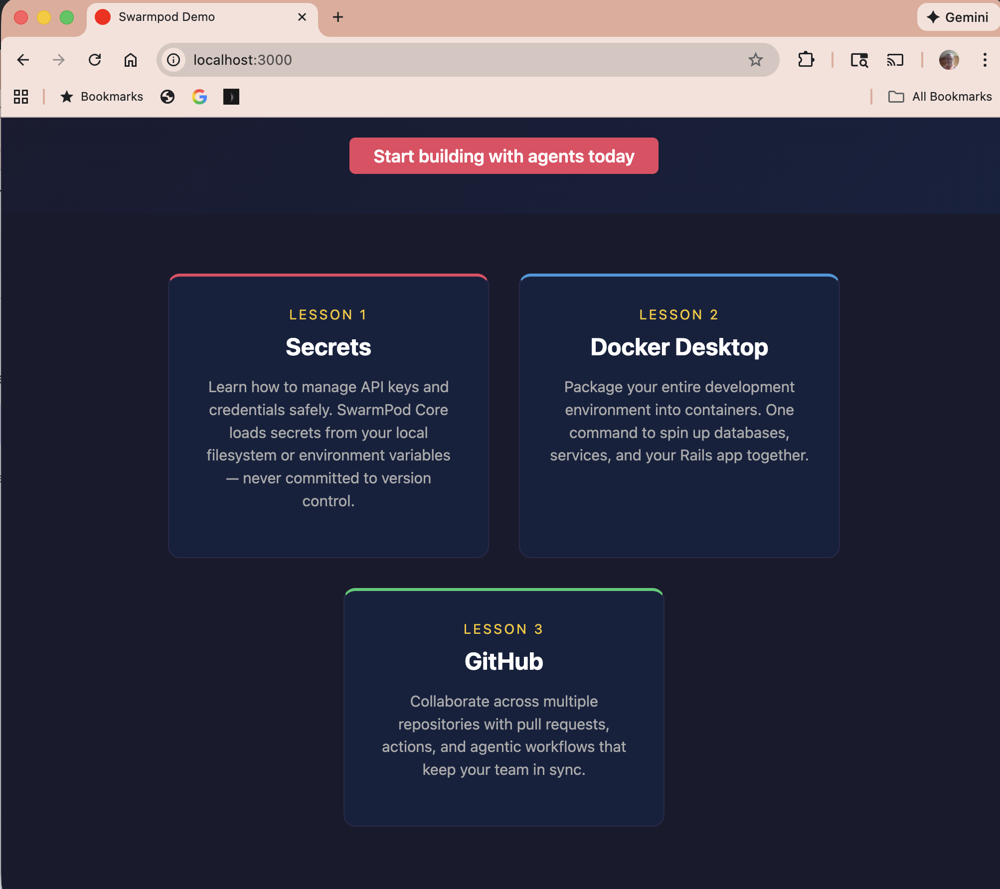

# SwarmPod Core

Ruby gem providing onboarding verify scripts and a Rails application template for new SwarmPod team members.



## What's Included

- **Verify scripts** — check that Anthropic, GitHub, Hostinger, and Z.AI service connections are working
- **Rails template** — `rails new myapp --template rails_swarmpod.rb` generates a styled demo app in one command
- **Secret management** — `discover_secret(env_var, file_path)` loads credentials from ENV or local `.sh` files, keeping them out of version control

## Prerequisites

- **Ruby 2.7+**
- **Claude CLI** — `npm install -g @anthropic-ai/claude-code`
- **Anthropic API key** with credits loaded
- **GitHub account** with a personal access token

Optional services:
- Hostinger VPS (for deployment)
- Z.AI account (for AI chat)

## Quick Start

1. **Install the gem**

   ```bash
   gem install swarmpod-core
   ```

2. **Set up secrets**

   Create `~/.swarmpod/secrets/` and add shell files with your credentials:

   ```bash
   mkdir -p ~/.swarmpod/secrets
   ```

   ```sh
   # ~/.swarmpod/secrets/anthropic.sh
   export ANTHROPIC_API_KEY="sk-ant-..."
   ```

   See `secrets_example/` for the full list of templates.

3. **Run the connection verifier**

   ```bash
   verify_connections
   ```

   Or run individual verifiers:

   ```bash
   verify_anthropic_connection
   verify_claude_connection
   verify_github_connection
   verify_hostinger_connection
   verify_swarmpod_connection
   verify_zai_connection
   ```

## Rails Template

Generate a complete SwarmPod demo app:

```bash
rails new myapp --template path/to/templates/rails_swarmpod.rb
cd myapp
bin/rails server
```

This creates a styled home page with lesson cards linking to the SwarmPod curriculum and a `/next` page explaining the architecture.

## See Also

- [swarmpod-core on GitHub](https://github.com/CbiPerson/swarmpod-core)
- [CbiPerson](https://github.com/CbiPerson) — all SwarmPod repositories
