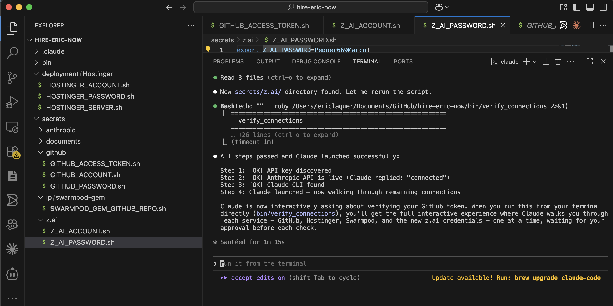
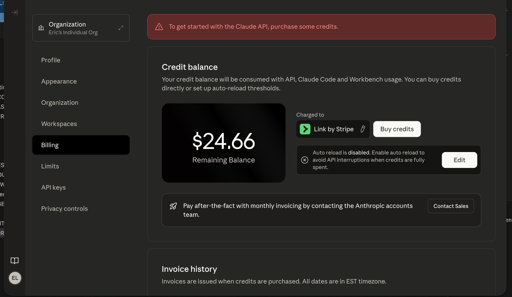
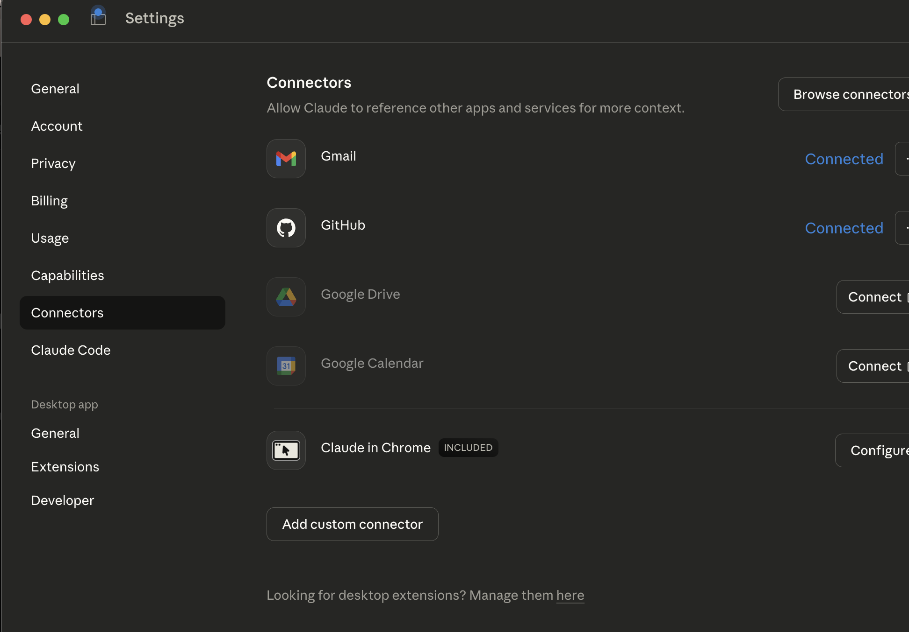

# SwarmPod Onboarding Plugin

Onboarding companion for [swarmpod-gem](https://github.com/CbiPerson/swarmpod-gem) — the multi-agent orchestration engine for Rails.

This plugin provides verify scripts and visual guides to help new team members connect all required services and confirm everything works before diving into development.

## Prerequisites

- **Ruby 2.7+** (the verify scripts are Ruby)
- **Claude CLI** — `npm install -g @anthropic-ai/claude-code`
- **Anthropic API key** with credits loaded
- **GitHub account** with a personal access token

Optional services:
- Hostinger VPS (for deployment)
- Z.AI account (for AI chat)

## Quick Start

1. **Clone this repo**

   ```bash
   git clone https://github.com/CbiPerson/swarmpod-onboarding-plugin.git
   cd swarmpod-onboarding-plugin
   ```

2. **Copy the secret templates and fill in your values**

   ```bash
   cp -r secrets_example/ secrets/
   ```

   Edit each file in `secrets/` to replace placeholders with your actual credentials. The directory structure tells you which service each credential belongs to:

   ```
   secrets/
   ├── anthropic/ANTHROPIC_API_KEY.sh
   ├── github/GITHUB_ACCOUNT.sh
   ├── github/GITHUB_ACCESS_TOKEN.sh
   ├── deployment/Hostinger/HOSTINGER_ACCOUNT.sh
   ├── deployment/Hostinger/HOSTINGER_PASSWORD.sh
   ├── deployment/Hostinger/HOSTINGER_SERVER.sh
   ├── ip/swarmpod-gem/SWARMPOD_GEM_GITHUB_REPO.sh
   ├── z.ai/Z_AI_ACCOUNT.sh
   └── z.ai/Z_AI_PASSWORD.sh
   ```

3. **Run the connection verifier**

   ```bash
   bin/verify_connections
   ```

   This walks you through each service step by step, then hands off to Claude to interactively verify the remaining connections.

4. **Or run individual verifiers**

   ```bash
   bin/verify_anthropic_connection
   bin/verify_claude_connection
   bin/verify_github_connection
   bin/verify_hostinger_connection
   bin/verify_swarmpod_connection
   bin/verify_zai_connection
   ```

## What a Successful Setup Looks Like

After running `verify_connections`, you should see output like this:



Your Anthropic dashboard should show active billing:



Claude desktop with connected services:



## See Also

- [ONBOARDING.md](ONBOARDING.md) — Detailed step-by-step setup checklist
- [swarmpod-gem](https://github.com/CbiPerson/swarmpod-gem) — The orchestration engine itself
